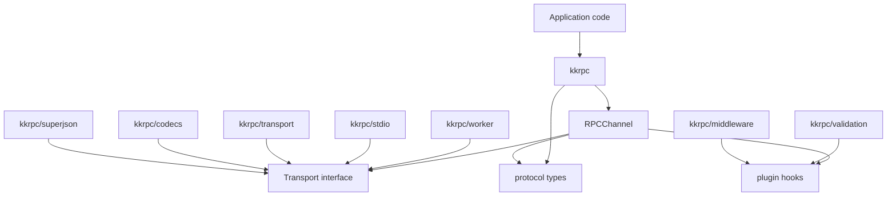
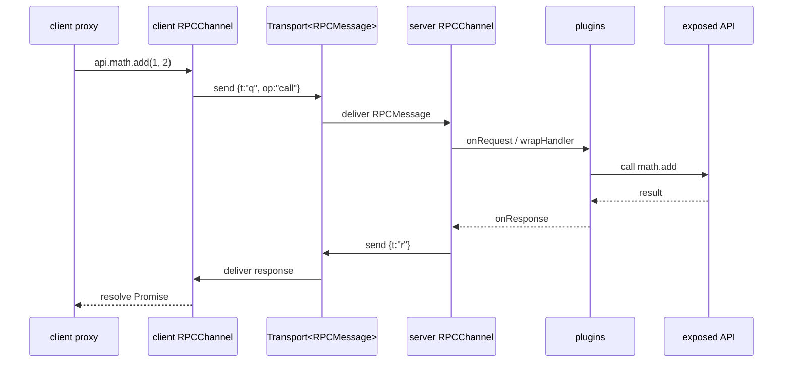

kkRPC is built from four independent layers: a compact wire protocol, a `Transport` interface that moves protocol messages, an `RPCChannel` that owns one transport and manages the request lifecycle, and a `Proxy` that translates property accesses and function calls into protocol messages. Each layer is testable in isolation, and optional features — validation, middleware, SuperJSON, streaming — attach through a plugin interface without touching the core.

## The Transport interface

A `Transport<TMessage>` is the only boundary between `RPCChannel` and the outside world. It has three required members and two optional ones:

```typescript
interface Transport<TMessage> {
  /** Optional capability flags used for feature negotiation. */
  capabilities?: TransportCapabilities
  /** Send one message, optionally with transferables when supported. */
  send(message: TMessage, transfers?: Transferable[]): void | Promise<void>
  /** Subscribe to incoming messages and return an unsubscribe callback. */
  subscribe(listener: (message: TMessage) => void): () => void
  /** Close the transport and release runtime resources. */
  close?(): void
  /**
   * Register a listener invoked at most once when the transport stops
   * delivering messages because the connection dropped (remote close or
   * network error). Returns an unsubscribe function.
   */
  onClose?(listener: (reason?: Error) => void): () => void
}
```

Transports push messages to subscribers rather than exposing a blocking read loop. This makes browser event sources, WebSocket handlers, and `postMessage` listeners straightforward to model — they are already push-based.

### Capability flags

The optional `capabilities` object advertises what the transport can do. `RPCChannel` reads these flags before forwarding transferables or enabling optional features.

```typescript
interface TransportCapabilities {
  /** Carries JavaScript objects without string serialization (structured-clone-grade). */
  objectMode?: boolean
  /** The transport can forward Transferable objects with sent messages. */
  transfer?: boolean
  /** The transport may deliver messages to more than one peer. Informational. */
  broadcast?: boolean
  /** The transport can carry bidirectional remote-reference request traffic. */
  remoteRefs?: boolean
}
```

### Platform and Codec composition

Most built-in transports are assembled from two lower-level primitives using `createTransport()` from `kkrpc/transport`:

- A **`Platform<TWire>`** moves wire values for one runtime primitive (a WebSocket, a stdio stream, a Worker).
- A **`Codec<TMessage, TWire>`** translates between `RPCMessage` objects and the platform's wire format (JSON lines, object-mode, etc.).

```typescript
import { createTransport } from "kkrpc/transport"

const transport = createTransport({
  platform,   // Platform<TWire>  — handles the runtime I/O
  codec,      // Codec<RPCMessage, TWire> — handles serialization
  capabilities?: TransportCapabilities  // optional overrides
})
```

Transfer support on the composed transport is enabled only when **both** the platform and the codec advertise `transfer: true`. This prevents accidentally forwarding transferables through a serializing codec that cannot preserve them.

## RPCChannel

`RPCChannel<LocalAPI, RemoteAPI>` is the core class. It owns one `Transport<RPCMessage>`, exposes an optional local API, and creates a proxy for the remote API. All request/response matching, callback routing, transfer descriptors, timeouts, plugin hooks, and lifecycle cleanup happen here.

```typescript
import { RPCChannel } from "kkrpc"

const channel = new RPCChannel<LocalAPI, RemoteAPI>(transport, {
  expose: localAPI,         // optional: expose a local API to the remote side
  timeout: 30_000,          // default 30 s; set 0 to disable timeouts
  plugins: [],              // RPCPlugin[] for validation, middleware, etc.
  onClose(reason) {},       // called once when the transport reports close
  onUncaughtError(err, ctx) {}  // diagnostics for fire-and-forget paths
})

const remote = channel.getAPI()   // typed RemoteAPI proxy
channel.destroy()                 // unsubscribes, rejects pending calls
```

### Channel options

```typescript
interface RPCChannelOptions<LocalAPI extends object = object> {
  /** Local API object to expose to the remote side. */
  expose?: LocalAPI
  /** Request timeout in milliseconds. Set to 0 to disable. Default: 30000. */
  timeout?: number
  /** Disable transferable forwarding even when the transport supports it. */
  enableTransfer?: boolean
  /** Plugins that run while handling incoming requests. */
  plugins?: RPCPlugin[]
  /** Optional provider for protocol-level metadata on outgoing request messages. */
  getMetadata?: () => RPCMessageMetadata | undefined
  /** Called once when the underlying transport reports the connection closed. */
  onClose?: (reason?: Error) => void
  /** Observe errors from fire-and-forget paths (set, callback). */
  onUncaughtError?: (error: Error, context: { kind: "set" | "callback"; path?: string[] }) => void
}
```

### wrap and expose

`wrap()` and `expose()` are convenience wrappers around `RPCChannel` for the common one-sided cases:

```typescript
import { wrap, expose, dispose } from "kkrpc"

// Client-only proxy. Dispose with dispose(api).
function wrap<RemoteAPI extends object>(
  transport: Transport<RPCMessage>,
  options?: Omit<RPCChannelOptions, "expose">
): RemoteAPI

// Server-side exposure. Dispose with controller.dispose().
function expose<LocalAPI extends object, RemoteAPI extends object>(
  api: LocalAPI,
  transport: Transport<RPCMessage>,
  options?: Omit<RPCChannelOptions<LocalAPI>, "expose">
): ExposedController<LocalAPI, RemoteAPI>

// Destroy the channel associated with a wrap() proxy.
function dispose(api: object): void
```

`ExposedController` gives you access to the channel and a `dispose()` shorthand:

```typescript
interface ExposedController<LocalAPI, RemoteAPI> {
  channel: RPCChannel<LocalAPI, RemoteAPI>
  dispose(): void
}
```

## Proxy semantics

`channel.getAPI()` returns a `Proxy` rooted at an empty path. Accessing nested properties extends the path; calling the proxy invokes the current path as a remote operation. Four operations are supported:

| Operation | Trigger | Protocol op |
|---|---|---|
| `get` | `await api.counter` | `"get"` |
| `set` | `api.counter = 42` | `"set"` |
| `call` | `await api.math.add(1, 2)` | `"call"` |
| `new` | `await new api.RemoteClass(args)` | `"new"` |

Remote reads are always asynchronous because the value lives on the other side of a transport:

```typescript
interface SettingsAPI {
  counter: number
  settings: { theme: string }
}

const api = wrap<SettingsAPI>(transport)

// Reads return Promises
console.log(await api.counter)           // resolves to the remote value
console.log(await api.settings.theme)   // nested path read

// Writes are fire-and-forget
api.counter = 42
api.settings.theme = "dark"
```

### Per-call options

Use `withCallOptions()` to override timeout or attach an `AbortSignal` on a per-call basis without changing the channel default:

```typescript
import { wrap, withCallOptions } from "kkrpc"

const api = wrap<RemoteAPI>(transport)
const quick = withCallOptions(api, { timeout: 2000 })
await quick.slowOperation()   // rejects after 2 s

const controller = new AbortController()
const cancelable = withCallOptions(api, { signal: controller.signal })
cancelable.longRunning().catch(() => {})
controller.abort()
```

## Message protocol

The wire protocol is defined in `RPCMessage` — a discriminated union of six compact record types. Short keys reduce serialized size for string transports.

```typescript
// Any message accepted by RPCChannel
type RPCMessage =
  | RPCRequest        // { t: "q", id, op, p, a?, v?, meta? }
  | RPCResponse       // { t: "r", id, v?, e? }
  | RPCCallback       // { t: "cb", id, a }
  | RPCCallbackRelease  // { t: "cbr", ids }
  | RPCStreamRequest  // { t: "sq", id, sid, op, n?, v? }
  | RPCStreamResponse // { t: "sr", id, sid, d?, v?, e? }
```

<Accordion title="Request: RPCRequest">

```typescript
interface RPCRequest {
  t: "q"                    // message tag
  id: string                // unique request id
  op: "call" | "get" | "set" | "new" | "ref"  // operation
  p: string[]               // property path on the exposed API
  a?: unknown[]             // encoded call arguments
  v?: unknown               // encoded setter value
  meta?: RPCMessageMetadata // optional trace/correlation metadata
}
```

</Accordion>

<Accordion title="Response: RPCResponse">

```typescript
interface RPCResponse {
  t: "r"         // message tag
  id: string     // matching request id
  v?: unknown    // successful result value
  e?: RPCError   // error payload when the request failed
}

interface RPCError {
  n: string      // error name (e.g. "TypeError")
  m: string      // error message
  s?: string     // optional stack trace
  [key: string]: unknown  // additional enumerable error fields
}
```

</Accordion>

<Accordion title="Callback messages: RPCCallback and RPCCallbackRelease">

```typescript
// Invoke a callback function registered on the owner side
interface RPCCallback {
  t: "cb"
  id: string      // callback id allocated by the owner
  a: unknown[]    // encoded callback arguments
}

// Tell the owner to drop callback registry entries
interface RPCCallbackRelease {
  t: "cbr"
  ids: string[]   // callback ids no longer held by the sender
}
```

Callback arguments are wrapped in envelope objects (`{ __kkrpc_next_arg__: "callback", id }`) so user data cannot be confused with callback markers. The channel automatically deduplicates callbacks by identity, and `FinalizationRegistry` (where available) releases them when facades are garbage-collected.

</Accordion>

<Accordion title="Streaming messages: RPCStreamRequest and RPCStreamResponse">

```typescript
// Consumer → producer: pull N more items, or close the iterator
interface RPCStreamRequest {
  t: "sq"
  id: string                         // control id
  sid: string                        // stream id
  op: "pull" | "return" | "throw"    // operation
  n?: number                         // items to pull (for "pull")
  v?: unknown                        // value for "return" / "throw"
}

// Producer → consumer: yielded data or acknowledgement
interface RPCStreamResponse {
  t: "sr"
  id: string      // data id, or matching control id for ack
  sid: string     // stream id
  d?: boolean     // true when the iterator is done
  v?: unknown     // yielded / returned value
  e?: RPCError    // error when the iterator operation failed
}
```

Streaming uses windowed pull backpressure. Breaking out of a `for await` loop sends a `return` control to the producer.

</Accordion>

## Plugin system

Plugins attach to `RPCChannel` through a four-hook lifecycle that runs for every incoming request. They share a mutable `state` bag per request for coordination between plugins.

```typescript
interface RPCPlugin {
  name?: string
  /** Inspect or mutate the request before handler execution. */
  onRequest?(ctx: RPCRequestContext): void | Promise<void>
  /** Wrap local handler execution (onion chain). */
  wrapHandler?(ctx: RPCHandlerContext, next: () => Promise<unknown>): Promise<unknown>
  /** Inspect or mutate a successful response before serialization. */
  onResponse?(ctx: RPCResponseContext): void | Promise<void>
  /** Observe or replace an error before serialization. */
  onError?(ctx: RPCErrorContext): void | Promise<void>
}
```

The `wrapHandler` hooks form an onion chain: each plugin calls `next()` to delegate to the next plugin (or to the actual handler). This is identical to Koa-style middleware and allows a plugin to inspect both the request arguments and the return value.

```typescript
import { expose } from "kkrpc"
import { middlewarePlugin, type RPCInterceptor } from "kkrpc/middleware"

const logger: RPCInterceptor = async (ctx, next) => {
  console.log("rpc:start", ctx.method, ctx.args)
  const result = await next()
  console.log("rpc:end", ctx.method)
  return result
}

expose(api, transport, {
  plugins: [middlewarePlugin([logger])]
})
```

<Note>
  The `middlewarePlugin` from `kkrpc/middleware` is a convenience wrapper that implements the `wrapHandler` hook. The `validationPlugin` from `kkrpc/validation` uses `wrapHandler` to check inputs before the handler runs and outputs after it returns.
</Note>

## Module dependency graph

The core `kkrpc` entry intentionally does not import any transport, codec, validation library, or optional peer. Optional feature entries import the core — never the other way around. This one-way dependency is the tree-shaking boundary.



A user importing only `kkrpc` does not pay for SuperJSON, validation libraries, middleware helpers, stdio, Worker-specific code, or optional peer transports. The `sideEffects: false` flag in `package.json` ensures bundlers can drop unreferenced subpath entries entirely.

## Runtime call flow

When you call a method on a remote proxy, the following sequence executes:



`RPCChannel` registers the pending request **before** sending, so a synchronous in-memory transport cannot deliver a response before the pending map entry exists.

## Transferable objects

When a transport advertises `capabilities.transfer = true` (Web Workers, for example), you can use `transfer()` to hand off ownership of an `ArrayBuffer` or other transferable without a copy:

```typescript
import { transfer } from "kkrpc"

const buffer = new ArrayBuffer(1024 * 1024)
await api.processBuffer(transfer(buffer, [buffer]))
```

On transports that do not support transfer, the argument is serialized normally — no special handling required on the caller side.

## Callback arguments

Evented transports (anything bidirectional) support passing callback functions as arguments. The channel stores the callback locally, sends a callback marker to the remote endpoint, and routes future invocations back through the same transport:

```typescript
type RemoteAPI = {
  onProgress(taskId: string, callback: (percent: number) => void): Promise<void>
}

const api = wrap<RemoteAPI>(transport)

await api.onProgress("build", (percent) => {
  console.log(`Progress: ${percent}%`)
})
```

Call `releaseCallback(fn)` to explicitly free the callback registry entry on the remote side when you no longer need it. On runtimes with `FinalizationRegistry`, facades are released automatically when garbage-collected.
